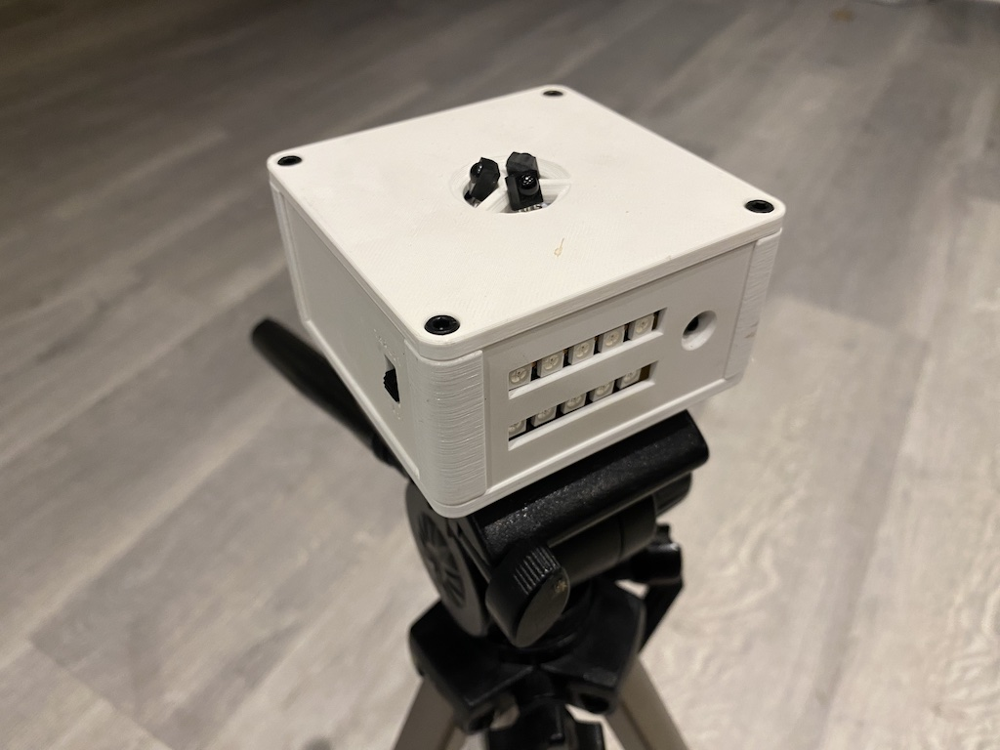
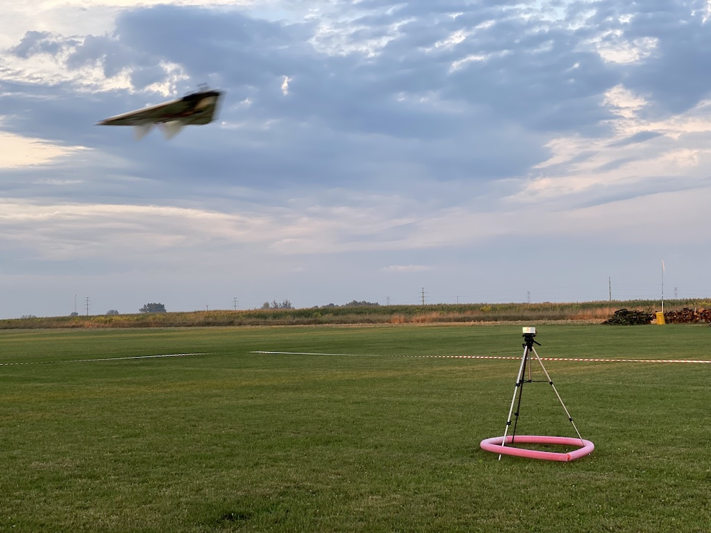

# FPVCombat Ground Target and Test Station

Turn your FPV Combat board, sensor and gun to a nice ground target and a reliable test station!  
You'll need [FPV Combat kit](https://fpv-combat.com/) and some other parts, full list below.  
Bottom plate has holes for easy mount on any standard camera tripod.  
Custom firmware for FPVCombat boards in form of `.hex` file can be downloaded from [Releases](https://github.com/ysoldak/fpvc-target/releases).

<table>
<tr><td>

</td><td>

</td></tr>
</table>

## Bill of materials

- FPV Combat kit (board, gun and sensor)  
  https://www.fpv-combat.com/product/fpvcombat_standard/
- HC-12 network board + antenna  
  https://www.amazon.com/HiLetgo-Wireless-Replace-Bluetooth-Antenna/dp/B01MYTE1XR
- Addressible 50x50 RGB LED strip (10 leds), dense  
  https://www.amazon.com/BTF-LIGHTING-WS2812B-Individual-Addressable-Non-waterproof/dp/B01CDTEJR0/
- XT60 connector with mounting brackets to fix with screws or any other regular XT60 connector to fix with hot glue
  https://www.rjxhobby.com/rjxhobby-4pcs-xt60c-m-plug-male-xt60-connector-with-mounting-bracket-black
- Switch for operation mode: TEST or TARGET  
  https://www.amazon.com/Position-Panel-Mount-Vertical-Switch/dp/B07QHCQMNC/
- M3 threaded inserts  (optional)  
  https://cnckitchen.store/products/gewindeeinsatz-threaded-insert-m3-short-100-stk-pcs

## Printing

Prints well in PLA and standard 0.4mm nozzle, no supports needed.
Everything can be printed without supports, even Top and Bottom plates (overhangs are printable w/o supports with a little trick implemented directly into 3D models)

Some parts (Top, Standoff) are available in two variants: basic and for M3 threaded inserts.
Without inserts assembly is faster, with inserts -- nicer and tolerates multiple assemblies/disassemblies.

## Wiring

Wiring of the sensor, gun, HC-12 and addressible 10 RGB strip is straightforward and shall not pose any problems.

### Special wiring
- Solder XT60 male connector to "+" and "-" of the board to power from any standard battery. Best if with extra mounting brackets to screw to the base plate.
- Solder mode switch to TRIG connector, shorting Signal and Ground enables "TARGET" mode.
- Connect 5V of I2C to any of RC PWM 5V (TRIG, IN or OUT)
- On HW26, sensor shall be connected to `Sensor 1` pins, other sensor pins will not work.

## Flashing

Use XLoader on Windows or avrdude on Mac/Linux to flash included .hex file to the HW25 combat board.
The combat board can be easily restored to original state by flashing official FPV Combat firmware again.

## Operation

Operation modes can be switched at any time with a help of the mode switch, see Wiring.

### Test Mode (default)
"Signal" and "Ground" of RC PWM TRIG must be disconnected.

Test mode is indicated by a sigle pixel/led moving back and forth.

1. Shoot at the station to start test sequence. First led turns green, means hit received.  
   Check your model's gun and/or sensor of the test station if you can't trigger test sequence.
2. Shortly after the first led, second led lights up either green (means OK) or red (means failure) indicating HC-12 module communication.  
   Check your model's HC-12 module and/or module of the test station if led turns red.
3. Test station then attempts to shoot at your model when both previois steps are green. Turn your model so one of its sensors points at the test station.
   Check your model's sensor and/or test station's gun if hit can't be scored at this stage.

Three leds shall turn green if all 3 tests pass, they then move down one row and moving led appears again indicating the station is ready for a new test session.
In case of any test step fails, respective led (GUN, NETWORK or SENSOR) turns red, state moves one row down and moving led indicates system is ready for a new test session.
Color of the moving led indicates the result of the previous test session (green for success and red for failure).

### Target Mode
"Signal" and "Ground" of RC PWM TRIG must be connected.

Target mode is indicated by 10 blue leds.

Once a hit is received, a single green led (top/first row) replaces the blue leds.
Once 5 hits received, first led of the bottom row turns green (indicating 5 hits) and first row clears.
10 hits indicated by red led of the second row.
Maximum number of hits indicated: 54 (five red leds of the second row and four green leds of the first row)
